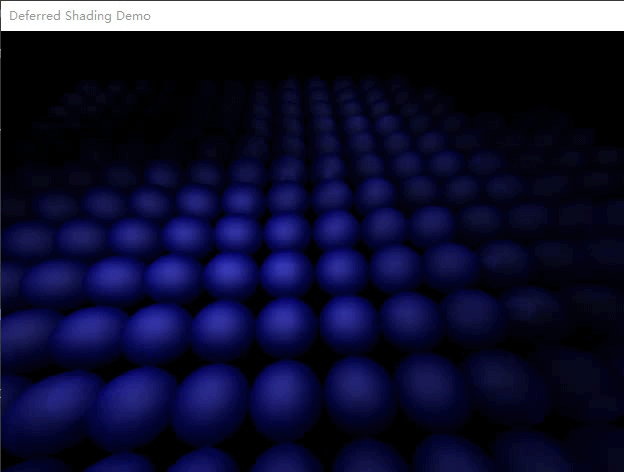

# deferred shading example

The example project for blog [deferred shading method in directx9][].

## prerequisite

- Windows OS (suggested 10)
- DirectX9 SDK installed and set `DXSDK_DIR` in Environment Variables

## run

1. Open .sln in VS2017 (suggested)
2. F5 run in Debug/Release x64 profile or download [release exe][v0.1 release] and run

## control

Change camera
- direction with `<left>, <right>` 
- radius with `<up>, <down>`
- height with `Ctrl + <up>, <down>`

Exit app
- with `Esc`

[deferred shading method in directx9]: https://dreamanddead.github.io/2019/04/26/deferred-shading.html

[v0.1 release]: https://github.com/DreamAndDead/deferred-shading-example/releases/download/v0.1/deferred-shading-demo.zip
